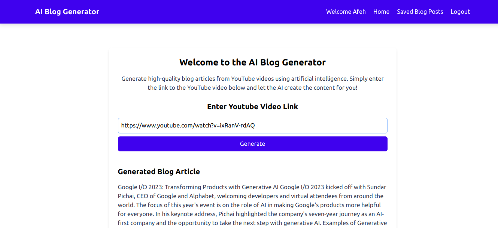

## [AI Blog Generator](https://ai-blog-generator-1rf1.onrender.com/)

This web app uses [Mistral AI](https://api-inference.huggingface.co/models/mistralai/Mistral-7B-Instruct-v0.2) to generate a blog post based on the content of a YouTube Video.

[](https://ai-blog-generator-1-ce1f.onrender.com/)
[](https://ai-blog-generator-1-ce1f.onrender.com/)


## How to use

1. Visit [https://ai-blog-generator-1-ce1f.onrender.com/](https://ai-blog-generator-1-ce1f.onrender.com/)
2. Create an account with your username and email.
3. Login with your username and password
4. In the YouTube Link input field, paste the URL of the YouTube video you want to generate a blog post for.
5. Click on the Generate button to get your blog post.
6. The blog post will be displayed on the page and saved to your profile.


## How it works

The [Mistral AI](https://api-inference.huggingface.co/models/mistralai/Mistral-7B-Instruct-v0.2) and [YouTubeTranscriptApi](https://pypi.org/project/youtube-transcript-api/) features are used in this application. Based on the user's input, the transcript of the YouTube Video is derived and then used as a prompt for Mistral AI to generate a blog post. The blog post is then displayed on the page and saved.

## Running Project Locally

1. Fork the repo
2. Clone the repo
3. Install dependencies

- Install Python 3.12.2
```bash
sudo apt update
sudo apt install software-properties-common
sudo add-apt-repository ppa:deadsnakes/ppa
sudo apt install python3.12.2
```
- Install Python 3.12-venv
```bash
sudo apt install python3.12-venv
```
- Create Virtual Environment
```bash
cd authapp
python3.12 -m venv venv
```
- Activate Virtual Environment
```bash
source venv/bin/activate
```
- Install Requirements
```bash
pip install -r requirements.txt
```
- Run Migrations
```bash
python manage.py migrate
```
- Run Server
```bash
python manage.py runserver
```
7. Go to [http://localhost:8000](http://localhost:8000) to see the project running.


If you like this project, please give it a star ⭐️

## Acknowledgement

Built by [Afebu Balogun](https://twitter.com/AfebuBalogun).
Mistral AI model from [Hugging Face](https://https://huggingface.co/), powered by [Mistral 7B](https://mistral.ai/news/announcing-mistral-7b/) & [Render](https://render.com/).

S/O to [CodeWithTomi](https://www.codewithtomi.com/)
